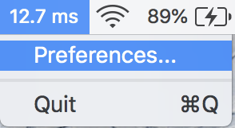

# Simple Ping 🏓

Ever experience lag or delay in the middle of Skype , Google Hangouts? Wish you have checked the internet connection before starting?

Or in the middle of uploading video to Youtube / Vimeo, you realized the internet connection is not right, and you are wondering whether to cancel the existing upload progress and move to somewhere else....

What if you could know how's your internet connection status before starting a video conference, uploading large files or playing multiplayer games?  And be able to monitor it constantly in Menu Bar?

Ping means your connection speed in miliseconds, the smaller the number, the better your connection is!

You can also change the ping destination to check connection status from your Mac to a certain location : 

## Privacy Policy

SimplePing app doesn't collect any data from you. No amount of data is collected in any manner.

## Support

Should you have any question / enquiries about this app, you can reach me at axel [at] fluffy.es .